# Oncom Modern Azure Data Platform

## Overview

**Oncom Modern Azure Data Platform** is an end-to-end Azure data engineering project built around a fictional global e-commerce and business operations dataset. The platform ingests Microsoft Dynamics-style CDM/CSV exports from Azure Data Lake Storage Gen2, processes data through a lakehouse medallion architecture (Raw → Bronze → Silver), builds analytics-ready dimensional models in Azure Databricks, orchestrates notebook execution via Databricks Workflows, implements metadata-driven data quality validation, and serves curated reporting data into Power BI.

The project demonstrates practical, production-style data engineering across cloud infrastructure, secure storage access, PySpark transformations, Delta Lake table design, Azure DevOps delivery management, workflow orchestration, Power BI star-schema modeling, and data quality engineering.

---

## Business Domains

The platform covers three business domains:

- **Purchase** - vendors, parties, purchase orders, purchase items, purchase categories, currency, cost centers, and fiscal/calendar dates
- **Sales** - customers, promotions, payment types, sales order lines, discounts, VAT, and sales order amounts
- **HR** - workers, verticals/departments, employment details, and compensation attributes

A fourth technical domain supports platform operations:

- **Data Quality** - metadata-driven rule configuration, SQL metadata migration, rule execution patterns, validation result handling, bad-record capture, and operational issue tracking

---

## Architecture

```
Microsoft Dynamics CDM/CSV Export (ADLS Gen2)
        │
        ▼
Azure Databricks - Raw Layer (Delta Lake)
        │
        ▼
Azure Databricks - Bronze Tables (Unity Catalog)
        │
        ▼
Azure Databricks - Silver Dimensions & Facts (Unity Catalog)
        │
        ├──► Databricks Workflows (Orchestration)
        │
        └──► Power BI Reporting Model (Star Schema)

Data Quality Path:
SQL Metadata (Azure SQL) ──► ADF Migration ──► Databricks DQ Execution ──► Failed Results View ──► Logic App / Azure DevOps
```

The Silver layer serves as the curated semantic source for Power BI. A parallel Data Quality path uses SQL metadata and Databricks notebooks to validate data across all lakehouse layers.

---

## Technology Stack

| Area | Technologies |
|---|---|
| Cloud Platform | Microsoft Azure |
| Storage | ADLS Gen2 |
| Processing | Azure Databricks, PySpark, Spark SQL |
| Table Format | Delta Lake |
| Orchestration | Databricks Workflows, Azure Data Factory |
| Catalog & Governance | Unity Catalog |
| Metadata Store | Azure SQL Database |
| Secrets Management | Azure Key Vault, Databricks Secret Scope |
| DevOps | Azure DevOps Repos, Branches, Work Items |
| Reporting | Power BI Desktop |
| Languages | Python, PySpark, SQL, DAX |
| Data Quality | Metadata-driven SQL rules, execution notebooks, validation outputs |

---

## Azure Platform Setup

The project runs in a dedicated Azure resource group containing the core platform services: Azure Data Factory, Azure Databricks, ADLS Gen2, and Azure Key Vault.

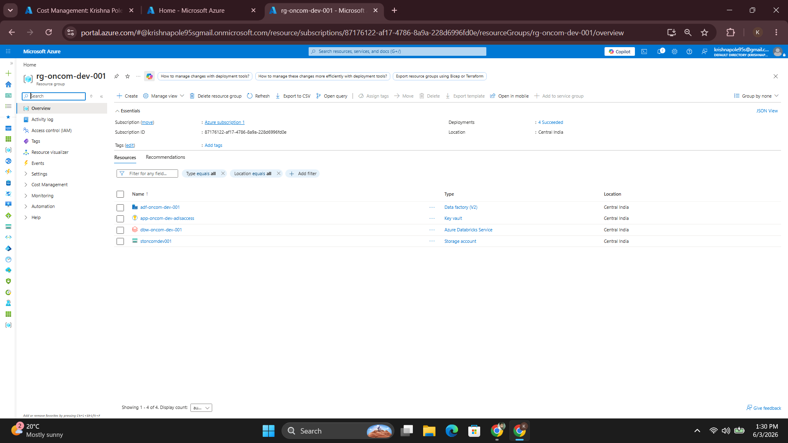

Azure Cost Management was used throughout development to monitor cloud spend and identify Databricks as the primary cost driver.

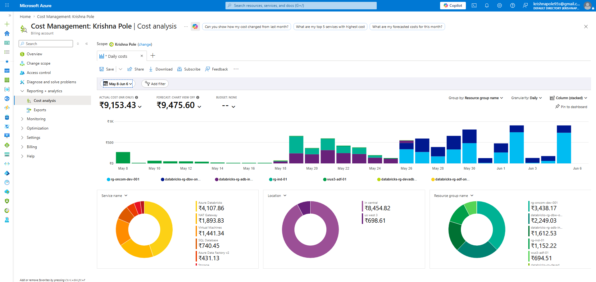

---

## Repository Structure

```
.
├── README.md
├── docs/
│   ├── architecture.md
│   ├── azure-devops-work-management.md
│   ├── data-models.md
│   ├── data-quality-framework.md
│   ├── databricks-setup.md
│   ├── known-issues-and-fixes.md
│   ├── powerbi-reporting.md
│   ├── project-log.md
│   ├── project-overview.md
│   ├── resource-setup.md
│   └── source-data.md
├── notebooks/
│   ├── raw/
│   ├── bronze/
│   ├── silver/
│   ├── data_quality/
│   └── workflows/
├── screenshots/
└── sql/
    ├── ddl/
    ├── config/
    ├── procedures/
    └── views/
```

---

## Lakehouse Layers

### Raw Layer

The Raw layer ingests CDM-style headerless CSV files from ADLS Gen2 and persists them as Delta Lake datasets. Because source files contain no headers, the ingestion framework reads schema metadata from CDM JSON descriptor files and applies explicit Spark `StructType` schemas before loading.

Raw ingestion covers:

- **Purchase** - `Parties`, `PartyAddress`, `VendTable`, `PurchContracts`, `PurchaseOrder`, `PurchItem`, `PurchCategory`
- **Sales** - `CustTable`, `PromoTable`, `SalesOrderLine`
- **HR** - `WorkerTable`
- **Reference** - `Currency`, `FiscalPeriod`, `CostCenter`

**Ingestion flow - reading an entity from ADLS:**


**Writing the output to a Delta path:**


---

### Bronze Layer

The Bronze layer registers Raw Delta outputs as managed Databricks tables in Unity Catalog. Bronze preserves the source-like structure while making data queryable via Spark SQL and available for downstream transformation.

**Reading from Delta path into Bronze:**


**Bronze tables registered in Unity Catalog:**

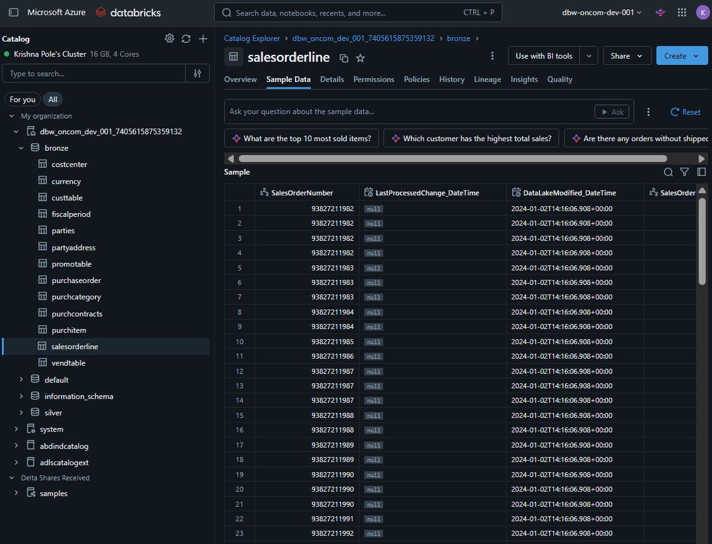

Bronze tables include:

| Schema | Table |
|---|---|
| bronze | parties, partyaddress, vendtable, purchaseorder, purchitem, purchcategory, purchcontracts |
| bronze | custtable, promotable, salesorderline |
| bronze | workertable |
| bronze | currency, fiscalperiod, costcenter |

---

### Silver Layer

The Silver layer creates analytics-ready dimensions and fact tables. Transformations include text trimming, timestamp normalization, default date handling, null handling, type casting, business key selection, deduplication, hash-key generation, lookup enrichment, and fact-table calculations.

**Reading Bronze schema into Silver:**

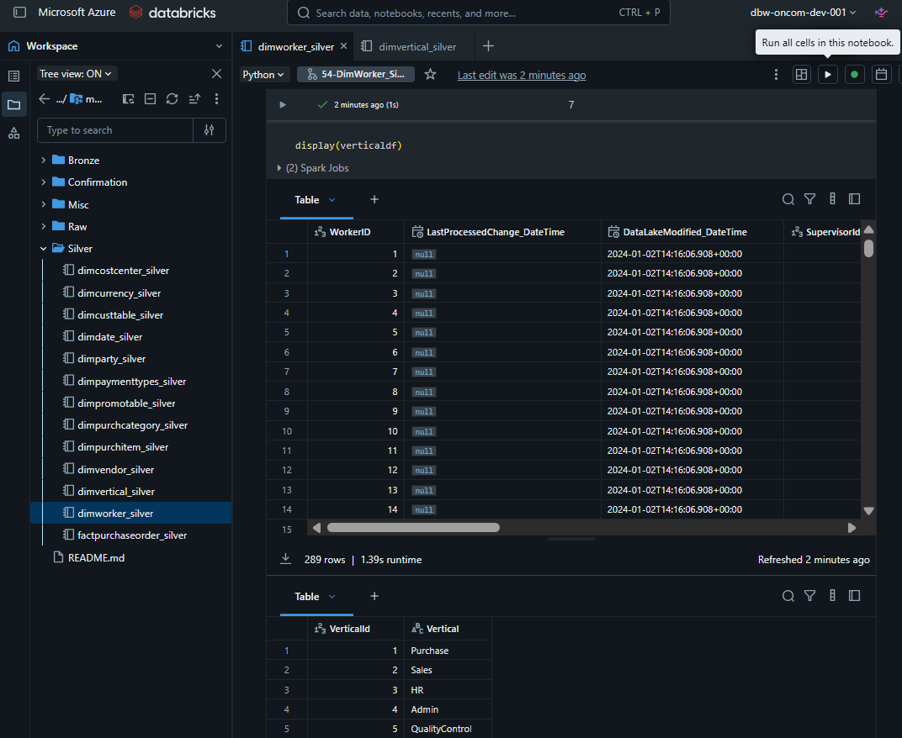

**Silver tables registered in Unity Catalog:**

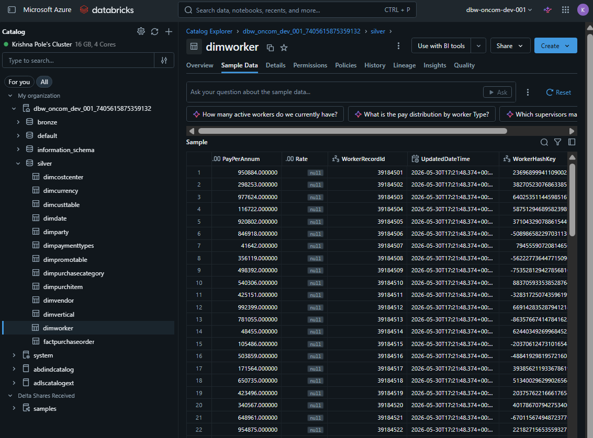

Silver tables:

| Type | Table |
|---|---|
| Dimensions | `silver.dimdate`, `silver.dimparty`, `silver.dimvendor`, `silver.dimpurchasecategory`, `silver.dimpurchitem`, `silver.dimcurrency`, `silver.dimcostcenter` |
| Dimensions | `silver.dimcusttable`, `silver.dimpromotable`, `silver.dimpaymenttypes`, `silver.dimvertical`, `silver.dimworker` |
| Facts | `silver.factpurchaseorder`, `silver.factsalesorderline` |

---

## Power BI Reporting

The Power BI model uses star-schema design over the Silver layer, with dimension-to-fact relationships, single-direction filtering, and reusable DAX measures.

**Core Purchase domain relationships:**

```
dimvendor[VendorId]             1 → * factpurchaseorder[VendorKey]
dimpurchasecategory[CategoryId] 1 → * factpurchaseorder[CategoryKey]
dimpurchitem[ItemId]            1 → * factpurchaseorder[ItemKey]
dimdate[DateId]                 1 → * factpurchaseorder[OrderDateKey]
```

**Key DAX measures:**

```dax
Total Purchase Amount = SUM(factpurchaseorder[TotalAmount])
Total Purchase Orders = COUNT(factpurchaseorder[PoNumber])
Total Quantity        = SUM(factpurchaseorder[Qty])
Total VAT Amount      = SUM(factpurchaseorder[VatAmount])
```

### Report Pages

**Home Dashboard** - top-level KPIs and summary visuals across all purchase activity

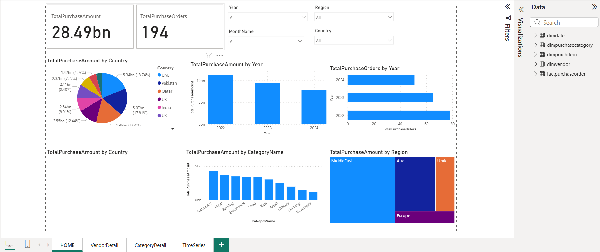

**Vendor Detail** - per-vendor breakdown of purchase amounts, order counts, and item distribution

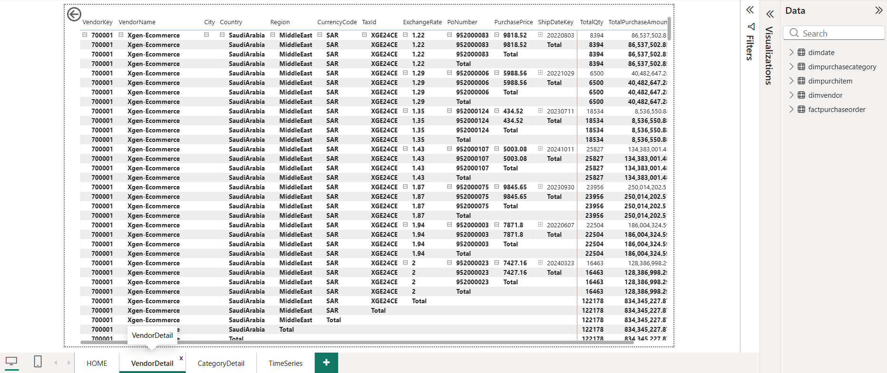

**Category Detail** - purchase performance sliced by procurement category

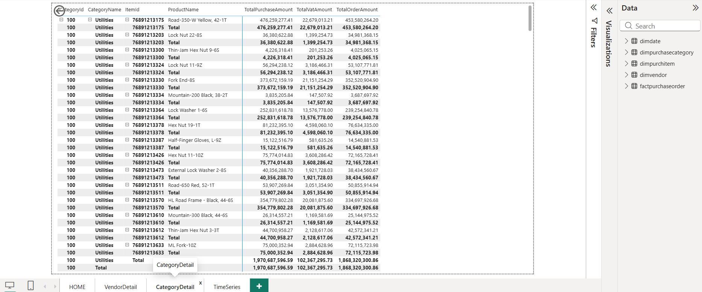

**Time Series Analysis** - trend analysis of purchase volumes and amounts over fiscal periods

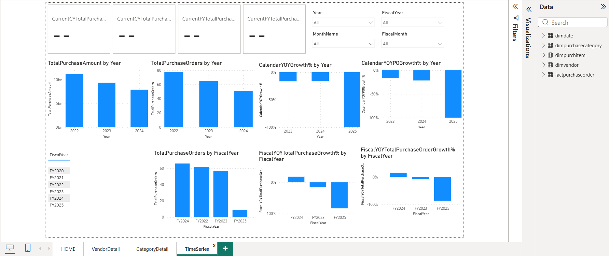

---

## Data Quality Framework

The Data Quality layer uses SQL metadata tables to define rules and Databricks notebooks to execute them against lakehouse tables. The metadata model supports primary key checks, record count comparisons, sum checks, and null checks.

**Core SQL metadata objects:**

| Object | Purpose |
|---|---|
| `dqr.dqchecks` | Data quality check types such as primary key, null, record count, and sum checks |
| `dqr.dqobjects` | Registered lakehouse objects |
| `dqr.dqrules` | Rule definitions and parameters |
| `dqr.incremental_load_mappings` | Watermark tracking for incremental loads |
| `dqr.sp_UpdateWatermark` | Stored procedure for watermark updates |
| `dqr.Vw_Rules` | Consolidated rule view for execution |
| `dqr.Vw_DQ_Failed_Results` | Failed validation results for review |

**Operational flow:**

```
DQ metadata (Azure SQL)
        │
        ▼
ADF incremental migration
        │
        ▼
Dev metadata database
        │
        ▼
Databricks DQ rule execution
        │
        ▼
DQ result & bad-record outputs
        │
        ▼
Failed-results view
        │
        ▼
Logic App → Azure DevOps bug tracking
```

**DQ rule execution in Databricks:**


---

## Azure DevOps Work Management

Project delivery was managed in Azure DevOps using Epics, Features, User Stories, work item dashboards, and sprint tracking.

**Backlog - Purchase and Sales domains:**

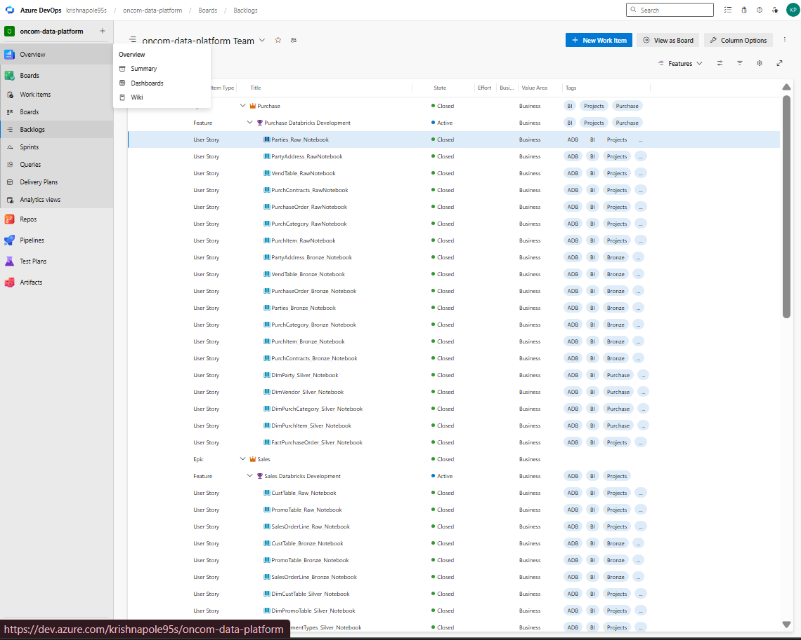

**Backlog - Data Quality and Workflows:**

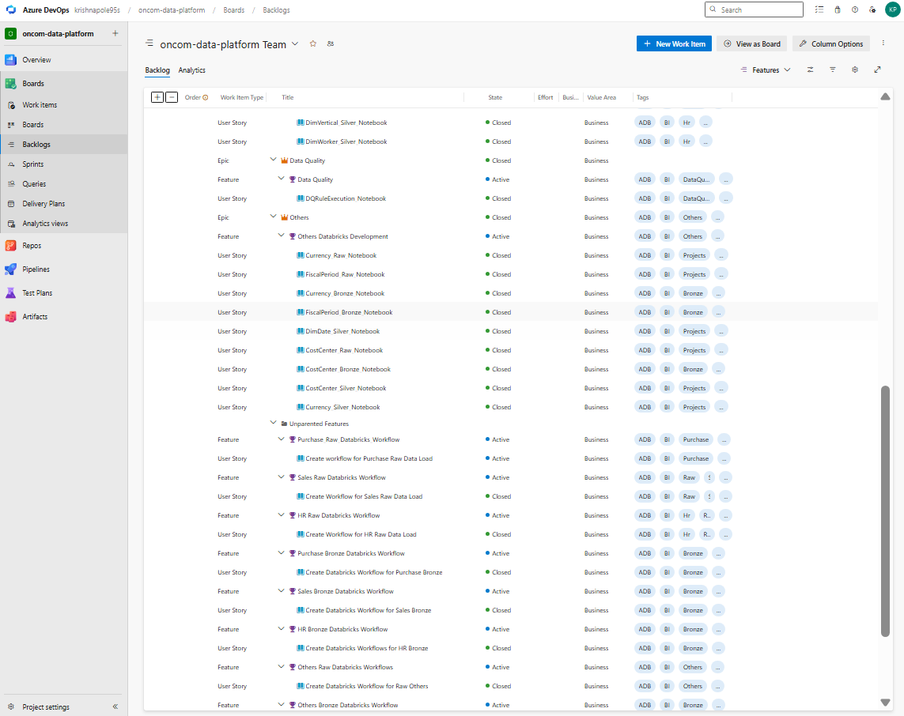

**Work item dashboard:**

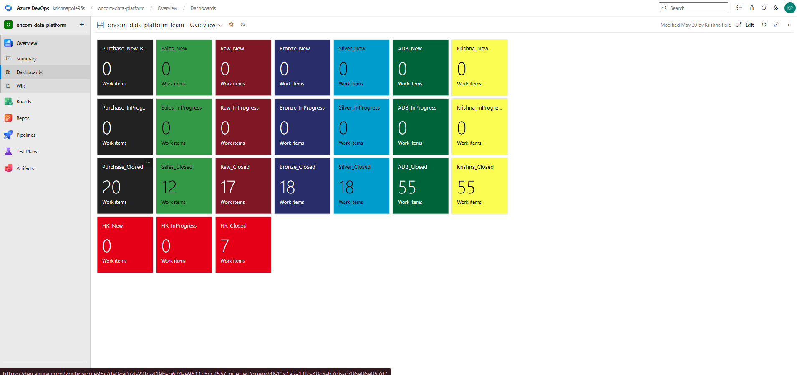

---

## Key Engineering Decisions

### Custom CDM Ingestion (Replaced Legacy Connector)

The initial design used a Spark CDM connector, which proved unreliable on the target Databricks runtime. The platform was redesigned around a custom schema-driven approach:

```
CDM JSON metadata
        │
        ▼
Dynamic Spark StructType
        │
        ▼
Headerless CSV read
        │
        ▼
Delta Lake output
```

This eliminated connector and runtime compatibility issues entirely, making ingestion portable across Databricks LTS versions.

### Databricks Secret Scope for Credential Management

Credentials are never hardcoded. All ADLS Gen2 and Azure SQL access uses Key Vault-backed Databricks secret scopes, ensuring no secrets are present in notebook code or version control.

### Silver-Layer Deduplication

Dimension keys exposed to Power BI must be unique to maintain valid relationships. Deduplication logic was implemented in the Silver layer for `dimdate`, `dimvendor`, `dimparty`, and `dimpurchasecategory`.

### Stable Power BI Model

The production report model prioritises stable star-schema relationships and correct filter propagation. Time-intelligence experiments were isolated from the main model to prevent visual regressions.

---

## Problems Solved

| Problem | Resolution |
|---|---|
| CDM connector compatibility failure | Custom CDM JSON schema-driven ingestion |
| Headerless CSV ingestion | Schema applied from CDM JSON metadata |
| Mixed source layouts (entity folders vs. direct CSV) | Flexible path resolution logic |
| ADLS OAuth configuration errors | Key Vault-backed secret scope |
| Databricks compute restrictions for Spark filesystem configs | Cluster-level config pattern |
| Duplicate `DateId` in `dimdate` | Silver-layer deduplication |
| Duplicate business keys in dimensions | Deduplication before key assignment |
| Delta schema mismatch during type changes | Schema evolution handling |
| `TotalOrder` stored as text | Explicit type cast in Silver |
| VAT percentage vs. VAT amount ambiguity | Source analysis + explicit column naming |
| Payment types derived from transactional data | Derived dimension pattern |
| Power BI relationship direction errors | Corrected model relationships |
| Power BI date/time relationship mismatch | Date key normalisation |
| ADF dynamic metadata migration issues | Parameterised pipeline redesign |
| DQ bad-record capture and failed-result handling | Separate bad-record output path |
| Logic App integration with Azure DevOps REST API | Connector + payload configuration |

---

## Professional Summary

This project demonstrates a complete, production-style Azure Data Engineering workflow: cloud resource provisioning, secure credential management, CDM data ingestion, medallion lakehouse architecture, Delta Lake table design, PySpark transformation logic, Databricks workflow orchestration, SQL metadata management, metadata-driven data quality validation, Azure DevOps delivery practices, and Power BI star-schema reporting.

It is designed as a practical portfolio project for Azure Data Engineer, Databricks Engineer, Cloud Data Engineer, and Data Platform Engineer roles.
