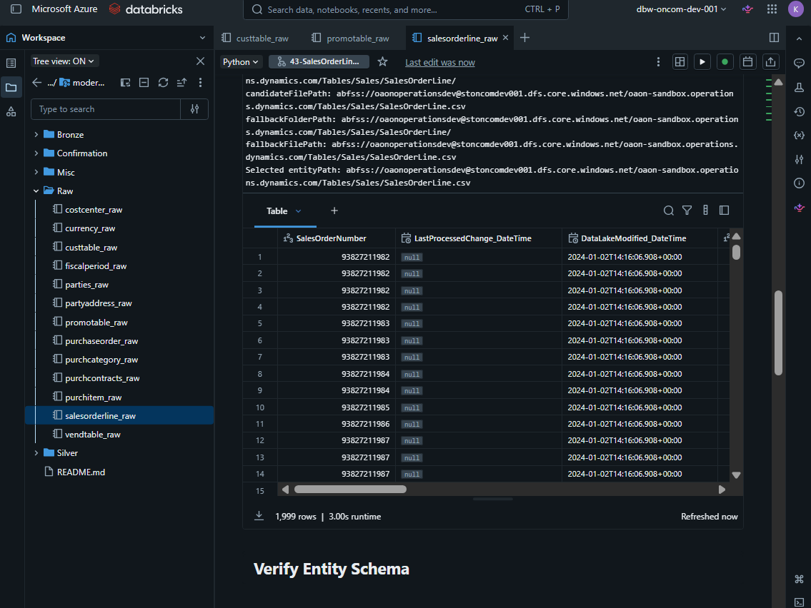
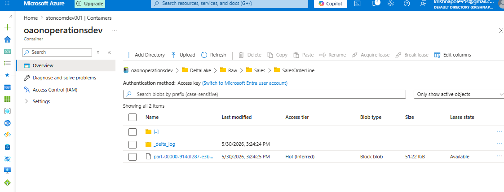
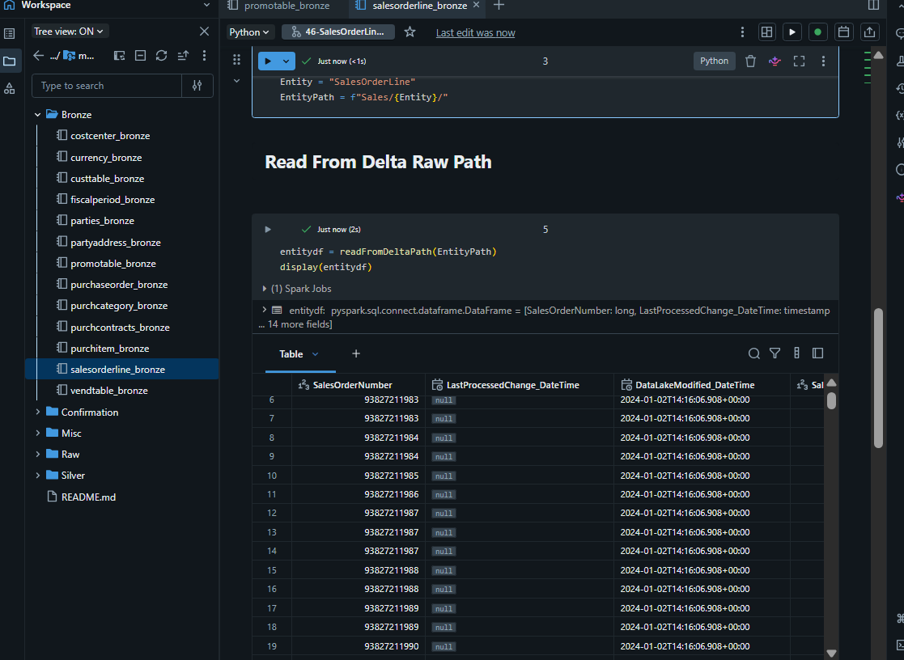

# Architecture

## High-Level Architecture

```
Microsoft Dynamics-style CDM/CSV Export (ADLS Gen2)
        │
        ▼
Azure Databricks — Raw Layer
        │
        ▼
Delta Lake Raw Storage
        │
        ▼
Azure Databricks — Bronze Tables (Unity Catalog)
        │
        ▼
Azure Databricks — Silver Dimensions & Facts (Unity Catalog)
        │
        ▼
Databricks Workflows (Orchestration)
        │
        ▼
Power BI Reporting Model (Star Schema)
```

---

## Data Quality Flow

```
Azure SQL DQ Metadata Source
        │
        ▼
Azure Data Factory — Incremental Migration
        │
        ▼
Azure SQL DQ Dev Database
        │
        ▼
Databricks DQ Rule Execution
        │
        ▼
DQ Results + Bad Records
        │
        ▼
Failed Results View
        │
        ▼
Logic App / Azure DevOps Bug Tracking
```

---

## Layer Responsibilities

### Source Layer

The source layer contains Microsoft Dynamics-style CDM/CSV exports stored in ADLS Gen2. Data arrives as headerless CSV files, with schema information available in accompanying CDM JSON metadata files.

### Raw Layer

The Raw layer reads source CSV files, applies schemas derived from CDM metadata, and writes the result as Delta Lake datasets.

**Reading a source entity from ADLS:**



**Writing the output to a Delta path:**



### Bronze Layer

The Bronze layer registers Raw Delta outputs as Databricks tables. Bronze keeps the structure close to source while making data queryable via Spark SQL and reusable for downstream transformations.

**Reading from a Delta path into Bronze:**



### Silver Layer

The Silver layer creates analytics-ready dimensions and facts. It applies cleaning, type casting, deduplication, enrichment, joins, date key generation, and business calculations.

### Reporting Layer

Power BI consumes curated Silver tables as its semantic source. The reporting model follows a star-schema structure with fact tables joined to dimensions.

### Data Quality Layer

The Data Quality layer stores rule metadata in Azure SQL, migrates rules incrementally with ADF, executes checks in Databricks, captures bad records, stores execution results, and exposes failed rows for monitoring and bug creation.

---

## Key Design Choices

- **Delta Lake** is used for reliable, ACID-compliant lakehouse storage across all layers.
- **Databricks** handles PySpark transformations, Unity Catalog governance, and DQ execution.
- **Azure SQL** stores DQ rule metadata and execution results.
- **Azure Data Factory** handles incremental metadata movement and orchestration.
- **Power BI** consumes curated Silver-layer outputs via a star-schema model.
- **Azure DevOps** tracks work items, branches, and DQ-triggered bugs.
